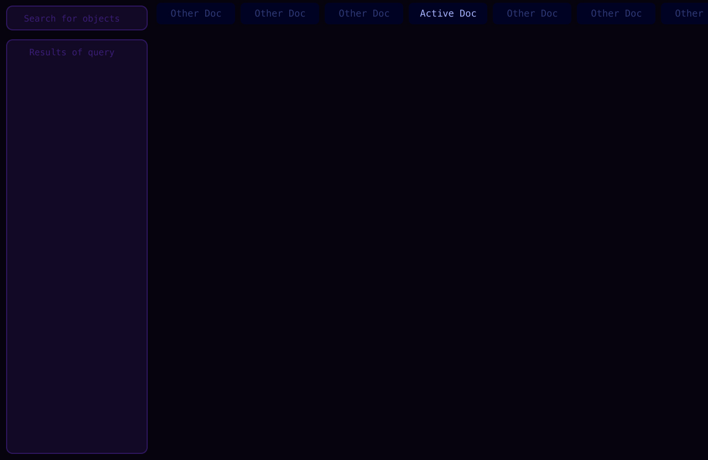
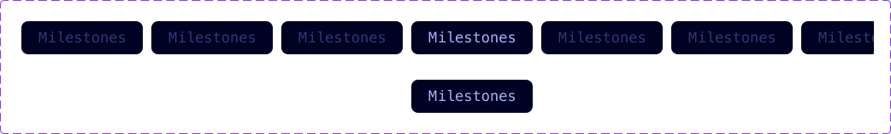
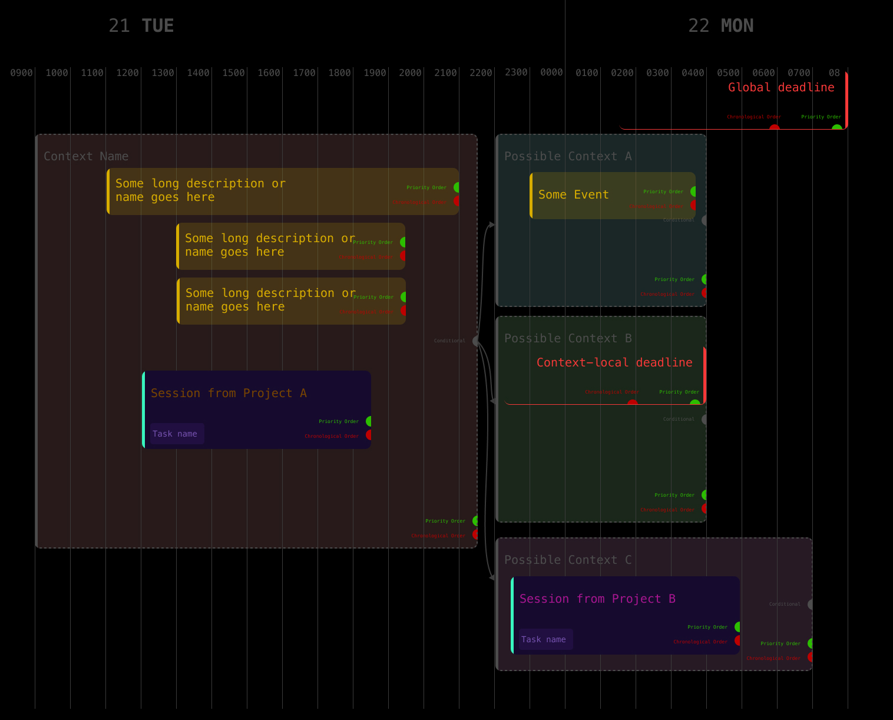
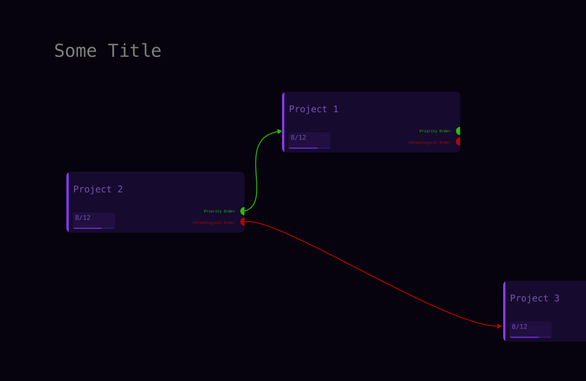
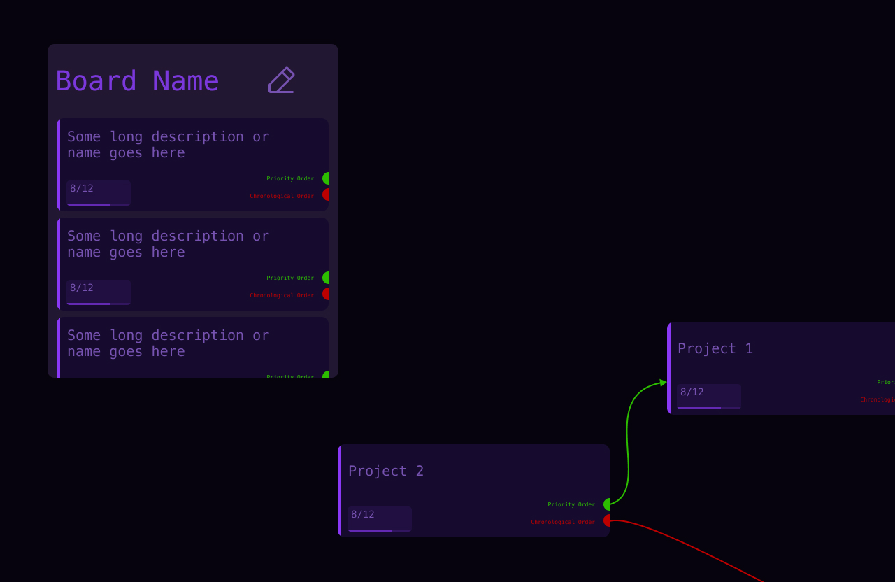

# LH2

LH2 (Lighthouse Hyperpanel) is a full-fledged, fine-grained, expansive personal productivity system designed to be visual and efficient.

All actions are taken from one single view — the Hyperpanel. Lighthouse follows the Getting Things Done (GTD) methodology, which revolves around breaking down all information into their smallest units — whether they're deliverables, tasks, or events — as well as ensuring everything is scheduled.

# Target Audience

Me, a young computer science student who wants to use this as a personal tool to manage all personal tasks/events/projects in one place.

The app does not have to be enticing/over-glamorous as I am ok with a simple and lightweight tool, but must be production-grade, reliable, and snappy.

# App Features

## 1: Interface Layout

This describes the interface for a desktop platform (desktop web). Ignore mobile/tablet platforms for now.

### 1.1: Tabbed Views

**1.1.1: Tab Bar**

Each view's name appears along the top in a tab bar, similar to that used by browsers or VS Code. Clicking on it will load up that view's exact configuration on the viewport. The tab bar is usually hidden, with only the current view's name showing at the top. It will reveal all view's tabs when the mouse enters over the tab bar area.

**1.1.2: Tab Creation**

Clicking on create new tab will trigger a right-click menu asking if a `Flow Canvas` or `Calendar Canvas` should be created.

**1.1.3: Tab Renaming**

Double clicking on the tab's name will allow the tab to be renamed in-place. Name is auto-saved once `Enter` is hit.

**1.1.4: Tab Closing/Deletion**

Hovering over a tab will expose an "x" button which, on pressed, will close that tab and discard its configuration and state data.

### 1.2: Query Box

**1.2.1: Query Box Overlay**

The leftmost area will have an overlay consisting of a search field where text queries can be keyed in, as well as an area to show query results, which is updated once `Enter` is hit.

**1.2.2: Query Syntax**

The query entry box will parse a query expression based on a context-free grammar with CLI-like syntax. However, that syntax is *not* determined yet, so for now accept any text input.

**1.2.3: Query Filters**

At the top of the query results box, there is a toggle switch labelled "Hide results in view". This will hide query results which show objects already present in the current viewport.

## 2: Canvases

The canvas is an interactive infinite scroll interface where multi-type widgets see (`3.1` and `3.2`) can be added and used.

### 2.1: Flow Canvas

This is the standard default canvas where nodes are added, and linked typically from left-to-right indicating some form of order/sequence. It has a grid background.

**2.1.1: CanvasController**

A controller object is needed to programmatically read and control the canvas' current state, including viewport zoom, pan, and node locations. The controller's state must then be saved as a JSON-encodable object to preserve the current tab's state.

### 2.2: Calendar Canvas

The calendar canvas is more advanced than the Flow Canvas, so it must have all the features mentioned in `2.1`, and more on top of that.

**2.2.1: Timescale Overlays**

The background of the calendar canvas is blank. However, an overlay called the timescale overlay will exist. It will have equally-spaced vertical rules. The overlay will still be the lowest layer in the widget hierarchy, except for the time markers (e.g "1200") and date markers (e.g. "21 TUE").

**2.2.2: Sticky Datetime Markers**

The time and date markers will be sticky, fixed to the top of the viewport despite vertical scrolling. Horizontal scrolling will allow the user to move forward and backward in time.

**2.2.3: Time Interval Scaling**

In the Calendar Canvas, vertical scrolling while holding down `Cmd` will result in the timescale being squished (scroll upwards) or expanded (scroll downwards). The timescale itself will change its styling based on the extent of the squish/expand:

1. Timescale lines and labels will move closer together or further apart.
2. Once a specific lower or upper threshold on the interval spacing is reached, alternating timescale lines are removed, so that the interval spacing returns to a value within the limits. The time markers will then go from "1100", "1200", "1300",... to "1100", "1300", "1500", etc.
3. Once the interval spacing gets to 24h between timescale rules, then the time markers will become the dates, "21 TUE", "22 WED" etc and the date marker will become the month.

**2.2.4: Free Drawing and Snap-To-Grid**

By default, all node additions, moving, etc. will be freehand (i.e. not snap-to-grid) and their start/end datetimes will not be updated based on their position on the canvas. Holding `Cmd` before tapping or moving or dragging a node will enable snap-to-grid. Snap-To-Grid only works for nodes, not widgets. If either of the start/end timestamps of a node have been snapped-to-grid, then when dragging the other end will automatically be snap-to-grid without holding down `Cmd`. In that case, holding down `Cmd` will disable snap-to-grid.

**2.2.5: Snappable Nodes**

Only the following node types can be snapped-to-grid: Deliverable, Session, Context, Event.

**2.2.6: Node Styling Choices**

The calendar-compatible node types (Deliverable, Session, Context, Event) will be styled differently in the Calendar Canvas as compared to the Flow Canvas. Take note of:

- Deliverable
    - special placing of out-ports
    - can be nested within context-requirement nodes
    - root-level deliverables (global deliverables) must not overlap with any other nodes

- Session
    - Description/Title text is colour-coded with the specific colours configured for each project
    - Also has the name of the task that it is from

- Context Requirement
    - Mixed-colour background of semi-opaque grey together with a semi-opaque colour based on the context requirement's specified colour-coding.
    - Dashed-line border and context name are grey.
    - Context Requirement nodes have an additional `conditional` port

- Event
    - Usually one-line or two-line name/description of event to preserve space.
    - Additional height if more details are given for the event

### 2.3: Right-Click Menu

**2.3.1: Adding Nodes**

When adding a node to the canvas (project, task, deliverable, etc.), right click the canvas, hover over the "Add Node" option, and a list of node types will appear. Hover over one, e.g. "project", and a list of the node templates for that node type will appear. Click on one and that is what will be added to the canvas. See `2.4.2` for configuring the node once added.

### 2.4: Information Popup

**2.4.1: Viewing Information**

When a node/widget is clicked, a pop-up appears beside it to show the full information. It consists of the fields which can be edited to modify the component's data, as well as Cancel and Save buttons. Hitting `Enter` or clicking outside the popup works the same as clicking Save. Hitting `Esc` works the same as clicking Cancel. The popup also has a Crosshair icon on the top right. When clicked, it triggers Crosshair Mode (see `2.4.3`).

**2.4.2: Adding Information**

When a node/widget has been added, a pop-up appears to configure the component. It consists of the fields needed to configure the component appropriately, as well as Cancel and Save buttons. Hitting `Enter` works the same as clicking Save.

**2.4.3: Crosshair Mode**

When the crosshair icon on the popup is clicked, Crosshair Mode is activated. A fixed-size overlay is added to the right side area of the viewport, and it will display all the information and editable fields of whichever node/widget the cursor is hovering over at any point. If a link is being added, its starting node information and its link data will also be displayed. Clicking or hovering over components will not trigger any information pop-ups since the crosshair overlay will already show that information.

### 2.5: Selection Tools

**2.5.1: Cmd-Shift-Select**

A node can be manipulated by clicking, but the same transformation/action can be performed on multiple nodes at once by holding down `Cmd+Shift` while clicking on nodes. Right-click menus and other action inputs will grey out or disable (but still show) any actions that cannot be performed on one or more of the selected objects. The selected items must have a blue outline added to them to indicate they are part of the selection.

**2.5.2: Marquee Select**

Typing `Cmd+M` will trigger the marquee selection mode with the first pointer down coordinates as the start point and will show a translucent selection box up to the coordinates of the current pointer location. Every node/widget within selection will have a border added to it, with the same color as the marquee selection box border.

## 3: Nodes, Widgets and Connections

All nodes and widgets can be dragged around, created, deleted, and duplicated.

### 3.1: Pre-Defined Widget Library

The widgets and their styles/behaviours are pre-defined in the sense that the code for them will already be existing and compiled. Only widgets from this library can be added. There will be no dynamic loading/creation of widgets at runtime through any sort of scripting language. However, the data itself loaded by the widgets will be pulled from the database and will be up-to-date.

**3.1.1: Text Widget**

An editable text field whose content and styling can be modified. Connections are added by clicking on an out-port (green/red circles in picture below), and then clicking on a destination node. While in the middle of adding a connection, nodes that are not suitable destinations (port type is not supported) will be greyed out.

**3.1.2: Query Board Widget**

A board which shows the latest results of a query, which is written in the language as per `1.2.2`. Height can be resized but the width is fixed. Board title can be renamed by double-clicking and editing in-place. Edit button is to edit the query itself.

### 3.2: Pre-Defined Node Library

**3.2.1: Node Templates**

While the schema for each node type (project, task, deliverable, etc.) is fixed, the actual information shown by each node widget, its styling, and behaviour can be customised and saved as presets. These are called node templates, and render a specific node type in different ways. See `2.3.1` for adding nodes through the right-click menu.

**3.2.2: Project Group Node**

This node cannot be directly added to the canvas, it is not an actual component that can be added or linked on canvas. Instead, every `Project Node` added to the canvas will belong to a project group, and will be colour coded accordingly.

**3.2.3: Project Node**

A project whose schema is defined in `lh2_stub/lib/types.dart`. It is the broadest unit (since project group is more of a meta-class just for tidying up the hierarchy rather than an actual function).

**3.2.4: Deliverable Node**

A deliverable whose schema is defined in `lh2_stub/lib/types.dart`. Deliverables are deadlines that the schedule gets planned around. Some projects use `Deliverable`s to define milestones.

**3.2.5: Task Node**

A task whose schema is defined in `lh2_stub/lib/types.dart`. Tasks are supposed to be a very specific action item that is pursued, with certain context requirements for when it can be done.

**3.2.6: Session Node**

A session whose schema is defined in `lh2_stub/lib/types.dart`. Sessions are spawned from tasks, and simply put, are "attempts" at a task. Certain tasks, when attempted, turn out to be more tedious or complicated, and require handoff to another time to be worked on (or, in other, words, another session). Sessions are planned blocks of time on the calendar to work on a task.

**3.2.7: Event Node**

An event whose schema is defined in `lh2_stub/lib/types.dart`. Events are usually from outside of projects, and are outside-world happenings that the schedule needs to be worked around.

**3.2.8: Context Requirement Node**

A context requirement whose schema is defined in `lh2_stub/lib/types.dart`. A task specifies its context requirements so that during planning, only timings on the calendar which meet those requirements should be considered for scheduling that task.

A context node also has a `conditional` port which is used to branch into multiple scenarios. Each scenario is its own `ContextRequirement` object, and can contain its own events/deadlines/sessions/etc.

**3.2.9: Actual Context Node**

An actual context whose schema is defined in `lh2_stub/lib/types.dart`. It reflects the current context conditions (as opposed to the planned context requirements that I would expect to be in at that same point in time, estimated at plannting-time). Specifying this enabled adaptation in real-time when reality differs from plans, so that tasks can be re-shuffled accordingly. Based on the actual context as updated by the user, `ContextRequirement` nodes with in-connections to `conditional` port (those that are being used to represent possible scenarios) will be greyed out if their requirement does not match the actual context features.

## 4: Keyboard Input

### 4.1: Keystroke Behaviour Modifiers

As mentioned in the other sections, holding down keys while performing an action will modify certain behaviour. Implement that.

### 4.2: Keyboard Shortcuts

Implement a rudimentary keyboard shortcuts engine which can map keystroke sequences to specific operations, and listens + responds accordingly.

## 5: Design and Styling

### 5.1: Design Philosophy and Branding

You may use the colours from my Figma design and colours from the `Colors` frame, and even with differing opacities. With regards to sizing, spacing, colours, font sizes, etc., use your own discretion but ensure **uniformity** and **harmony**. It does not have to look glamorous. It needs to be simple, efficient to read, and cohesive. For fonts, all will use the `Menlo` font family.

### 5.2: Figma Designs

My component designs and layout concept has been done in Figma. You may access the design files in my Figma project (https://www.figma.com/design/BBb9NHiYI9wMTtcbnEBXqi/LH2?m=auto&t=P0BqZyb0T7DGj98B-6). The MCP server for Figma is configured as `Figma MCP`, let me know if you cannot find it.

### 5.3: Responsive Design

Of course, the layouts and sizing must be responsive to screen size (within desktop dimensions), so take that into consideration when building the design system. The app only needs to work on desktop sizes for now (see `5.4` for more information).

### 5.4: Adaptive Design

For now, the app needs to work on desktop sizes only. In the distant future, I hope to roll out a much lighter and mobile-friendly version, with read-only views on all the tabs. You don't have to consider this feature too heavily for now.

## 6: Data and Auth

### 6.1: Authentication Platform

The storage platform is Firebase Authentication. For now, only focus on creating a user and setting up the user's data (in `6.2`), and not on the authentication flows for the user. We will not set up any auth for now.

### 6.2: Data Storage Platform

The storage platform is Firebase Firestore, a document-based storage.

Refer to `.rhog/boilerplate/db_interface.dart` for the database structure (e.g. what the root collections are) and how the database gets accessed with a standardised generic interface.

### 6.3: API Usage Optimisation

**6.3.1: Native In-App Caching**

When possible, utilise simple in-memory caching so that the same data is not loaded over and over within a short span of time even though it is not updated.
Refer to the boilerplate in `.rhog/skills/caching.dart` for a simple cache. You can implement the `GenericCache` at a widget-level or even page- or global-level.
The goal is to reduce unnecessary calls to Firestore API. You may feel free to improve on the implementation of `GenericCache` in whichever way you deem fit.

**6.3.2: Use of Keys to Reduce Widget Rebuilds**

When possible, use `Key`s to reduce rebuilds by contitioning the rebuild on a value change.

# 7: Overall Architecture

The way I want my app to work is for it to have a server that does the processing and the client merely provides the interface. However, right now, I will have *all* processing done on the client-side.

## 7.1: App (Client) Stubs

The classes extended on the client side (`DatabaseInterface`, `LH2API`, `LH2Object`, etc) are actually defined on the server-side code. However, since we will not have a server for now, we move all the stubs to the client-side.

Refer to `lh2_stub/lib` for the class definitions.

## 7.2: Performing Operations

All operations must be encapsulated as functions, not freely called in button events or whatnot. It must be well-defined with an operation ID and must have pre-defined error handling and error codes. It must throw when a fatal error has occurred and move on gracefully otherwise.

## 7.3: Logging and Observability

**7.3.1: Telemetry Instrumentation**

For now, capture only the error message, operation ID, data payload, and location within the codebase that threw the error. Print all these to console as JSON. Set up whatever classes/architecture is needed for this accordingly.